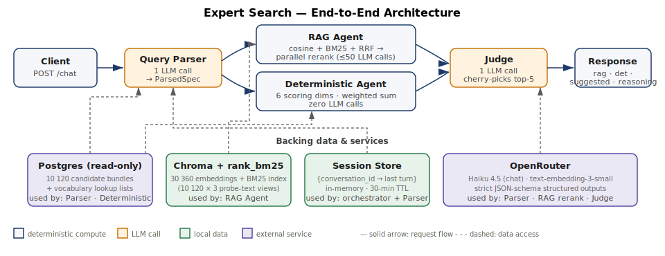
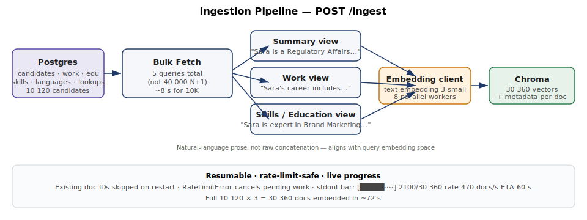
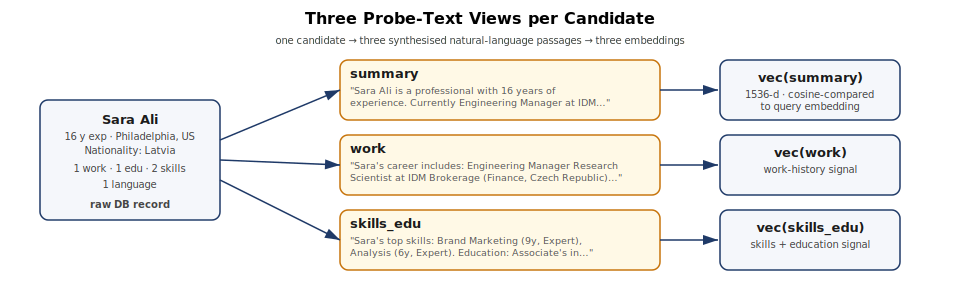
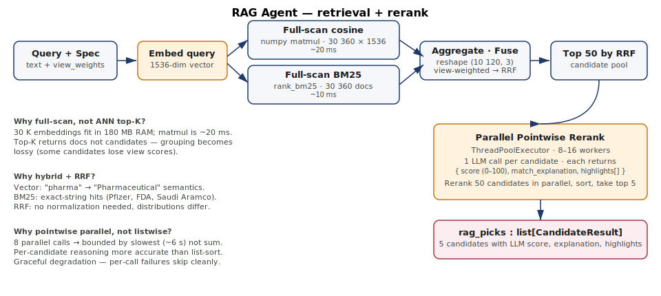
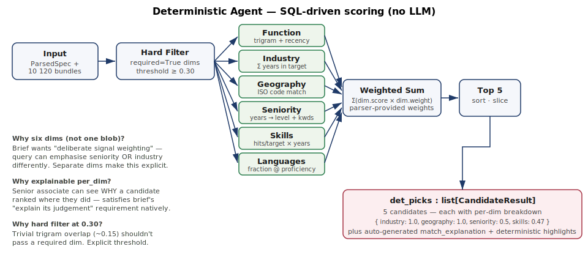
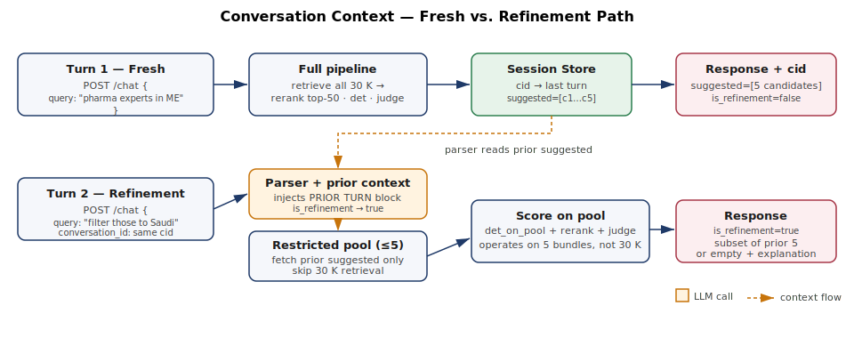

# Expert Search — Demo Guide

> Walk-through for the interviewer. **Page 1 is the one-screen overview.**
> Everything after is reasoning for each design choice, anchored by diagrams.

---

# Page 1 — Solution at a glance

**Problem.** Given a 10,120-candidate Postgres DB and a natural-language query like *"regulatory affairs experts in pharma in the Middle East"*, return the 5 best-matching experts with explainable scoring.

**Solution.** Two parallel scoring agents (semantic + structured) feeding a judge that cherry-picks the final 5.



**Why two agents.** Neither retrieval paradigm is right alone. A pure-RAG system fails on hard structural criteria (*"only Saudi-based"*); a pure-SQL-scoring system misses semantic synonyms (*"pharma" → "Pharmaceuticals"*). Running both on the same query and letting an LLM judge reconcile gives the floor of the strict one and the ceiling of the semantic one.

| | |
|---|---|
| **Candidates** | 10 120 |
| **Embeddings** | 30 360 (10 120 × 3 views) |
| **LLM calls per query** | 3 + *N* (parser + rerank-of-N + judge) |
| **Typical query latency** | 22–47 s (dominated by rerank) |
| **Full ingest cost** | ~$0.06 embeddings · ~72 s wall-clock |
| **Per-query cost** | ~$0.02–0.04 on Haiku 4.5 |

**Verified end-to-end.** 90/90 unit tests pass. Two live integration tests hit real Postgres + OpenRouter + Chroma. Manual-judging report in `evaluation_testing/` documents 5 queries with per-candidate grading.

**What's in this document.** Seven sections below, one design decision each. Read top-down for a full walk, or skip to the ones you want to press on.

---

## Contents

1. [Why a pipeline, not an "agent"](#1-why-a-pipeline-not-an-agent)
2. [Ingestion + why three views per candidate](#2-ingestion--three-views-per-candidate)
3. [Query understanding — parser + vocabulary grounding](#3-query-understanding)
4. [RAG agent — hybrid retrieval + parallel rerank](#4-rag-agent)
5. [Deterministic agent — six scoring dimensions](#5-deterministic-agent)
6. [Judge — one LLM call, full context](#6-judge)
7. [Conversational context — narrow-refinement only](#7-conversational-context)

Plus: [Evaluation](#evaluation) · [Trade-offs we made honestly](#trade-offs)

---

## 1. Why a pipeline, not an "agent"

Nothing in this system is a "real" agent in the technical sense — no tool-use loops, no self-directed trajectories, no `claude-agent-sdk`. It's a **deterministic pipeline of structured LLM calls**, each with a fixed input/output shape.

### Why I chose pipeline over agent

- **Brief's goal is precision, not exploration.** *"We care less about how many results come back and more about whether the right ones are at the top."* Agents are noisy — different runs produce different reasoning trajectories. Pipelines are reproducible.
- **The query shapes are knowable.** *"Find experts with X in Y in Z"* has a stable structure. A pipeline with a good query parser captures 95% of variation; an agent would re-derive it each turn.
- **Cost and latency.** Each LLM call in a pipeline is bounded, cacheable, and parallelisable. Agent loops can run away.
- **Debuggability.** Every call has a fixed schema, so every failure is attributable (parser emitted X → scorer got Y → wrong score). When my manual evaluation turned up a bug (see `docs/PART_3_EVALUATION.md` §3), I could pin it to one line in `score_industry`. An agent would have smeared that across three turns.

### Why chain prompting, not a single mega-prompt

One end-to-end prompt ("here's a query and 10K candidates, return the top 5 with reasoning") would:
- Blow the context window at 10K candidates.
- Provide no way to enforce structural constraints (query says "required: pharma" → how do you guarantee the LLM filters?).
- Mix retrieval and scoring and explanation into one opaque box, making every answer untrustable.

Chaining gives each stage a single, testable job:

```
parser:    NL text  →  ParsedSpec (typed, strict JSON schema)
retrieval: ParsedSpec + index  →  top-K candidate pool (deterministic)
rerank:    pool  →  ranked-5 with explanations (LLM-scored, parallel)
scoring:   ParsedSpec + bundles  →  weighted scores (pure Python)
judge:     two lists + profiles  →  final 5 (LLM cherry-pick)
```

Each stage has its own file, its own tests, and its own failure mode.

---

## 2. Ingestion + three views per candidate



**What happens.** 10,120 candidates are loaded from Postgres, rendered into three natural-language "probe texts" per candidate, embedded in parallel, and stored in Chroma with metadata. Total: **~72 seconds** for the full index.

### Why Chroma, not pgvector / Qdrant / FAISS

| Option | Pros | Cons | Verdict |
|---|---|---|---|
| **Chroma** | SQLite-backed file, zero infra, native metadata, simple API | Slower at billion scale | ✅ **Chosen.** At 30 K vectors we're nowhere near its limits. |
| pgvector | Data stays in Postgres | The DB creds are **read-only** — we can't write back | ❌ Blocked by credentials |
| Qdrant | Production-grade, hybrid search native | Docker/service to run, token budgeting for sparse vectors still client-side | Overkill |
| FAISS | Fastest in-memory | No metadata, no persistence, no hybrid | Loses too much |

Chroma's `PersistentClient` writes to `./data/chroma/*.sqlite3`. Pull once at startup into a numpy array; from there queries are pure math.

### Why three views per candidate, not one blob

This is the most load-bearing modelling choice.



Naïve approach: concatenate everything about a candidate into one long document, embed it, done. Problem:

- **Dilution.** Work history (hundreds of tokens) swamps skill names (dozens of tokens) when they're one vector.
- **Query alignment fails.** *"python expert"* is a skills query; its embedding should match the skills text strongly, not the career summary. A single-blob embedding can't give stronger signal on one part.
- **No way to weight.** Different queries want different slices of a profile. Three vectors let the parser emit `view_weights: {summary: 0.3, work: 0.5, skills_edu: 0.2}` and the aggregator honour them.

**The three views are deliberately engineered sentences, not concatenations:**

- **`summary`** — elevator pitch: name, current role, years, nationality, city. Matches "find me a senior PM in Berlin" style queries.
- **`work`** — narrative of job history with companies, industries, dates, descriptions. Matches "former CPO at a pharma company" style queries.
- **`skills_edu`** — top skills with years + proficiency, plus education. Matches "python expert" / "MIT grad" queries.

Natural-language prose (rendered by `app/probe_texts.py`) aligns far better with query embeddings than raw JSON or concat. This was the key single move that made RAG non-trivially useful on this synthetic data.

### The ingestion code is resumable and rate-limit-safe

Practical details that matter:

- **5 bulk queries, not 40 000 N+1.** First iteration of `fetch_all_bundles` did one WORK query per candidate (40 K queries total, stalled forever on the 10 K fetch). Rewrote to five `SELECT ... FROM work_experience` (etc.) without the `WHERE candidate_id = %s` clause, group in Python. Dropped 40 K queries → 5. Fetch time went from *hours* → **~8 seconds**.
- **Parallel embedding.** 8 worker threads issue `embed_batch` concurrently against OpenRouter. Hit ~470 docs/s sustained.
- **Rate-limit aware.** If `RateLimitError` is raised, pending workers are cancelled, Chroma retains what's done, and `stopped_reason` in the response says why. Re-running picks up where it stopped (existing doc IDs are skipped).
- **Live progress bar** on stdout: `[█████·····] 15808/29760 (53%) 409 docs/s ETA 34s`.

---

## 3. Query understanding

A single LLM call turns natural-language text into a typed `ParsedSpec` (Pydantic). Everything downstream reads the spec; no other component touches the raw query text (except BM25 + rerank).

### Shape of the spec

```python
class ParsedSpec(BaseModel):
    function:   DimensionSpec | None       # "Regulatory Affairs"
    industry:   DimensionSpec | None       # ["Pharmaceuticals", "Biotechnology"]
    geography:  GeoSpec | None             # ["AE", "SA", ...] + location_type
    seniority:  SenioritySpec | None       # ["senior", "executive"]
    skills:     SkillsSpec | None          # ["Python", "Kubernetes"]
    languages:  LanguagesSpec | None       # ["Arabic", "English"]
    min_years_exp: int | None
    temporality: Literal["current", "past", "any"]
    view_weights: ViewWeights | None       # for RAG aggregation
    is_refinement: bool                    # for conversation context
```

Each `DimensionSpec` has `values`, `weight`, and `required`. "Required" means **hard filter** — a candidate without that dim is dropped. Non-required dims contribute to the weighted score.

### Why strict JSON-schema outputs

Using free-text JSON and parsing it with `json.loads` (what the implementation plan originally specified) gave us 95% reliability — but the 5% was ugly: markdown fences, stray prose, missing fields, wrong types. We switched to OpenAI's **Responses API with `text_format=ParsedSpec`**, which:

- Generates a JSON schema from the Pydantic model.
- Sends that schema to OpenRouter (passes through to Anthropic).
- Gets back validated JSON that the SDK parses directly into a typed instance.
- Raises immediately if the model tries to return garbage.

Two gotchas found live (documented in `app/models.py`):
- Don't use `dict[Literal[...], float]` — Pydantic emits `propertyNames` which Anthropic rejects. Use a nested `BaseModel` instead (see `ViewWeights`).
- Don't use `Field(ge=..., le=...)` on int fields — same rejection. Clamp in Python post-parse.

### Why vocabulary grounding (the non-obvious move)

Without grounding, the parser invents strings: asked for "pharma", it might emit `"Pharmaceuticals"`, `"pharmaceutical"`, `"Pharma Industry"`. The DB actually uses `"Pharmaceuticals"`. A silent mismatch → scoring dim returns 0 → candidate drops → user blames the model.

**Fix:** at app startup, read every distinct `companies.industry`, `skill_categories.name`, `languages.name`, `proficiency_levels.name` from the DB into a `Vocabulary`. Inject a compact block into the parser's system prompt:

```
Known DB vocabulary — when the query implies one of these, you MUST
pick the EXACT string from the list (no new values, no paraphrases):

INDUSTRIES: Pharmaceuticals, Financial Services, Software Development, ...
SKILL CATEGORIES: Engineering, Marketing, Finance, ...
LANGUAGES: English, Arabic, Spanish, ...
PROFICIENCY LEVELS: Beginner, Intermediate, Fluent, Native
```

Then a post-validation pass drops any value the LLM emitted that isn't in the vocab. This is cheap (≈1K extra prompt tokens) and made the deterministic agent actually work on real queries.

I deliberately don't inject skills (1,551 values — too big) or job titles (~24K unique — vastly too big). Those stay free-text and are **fuzzy-matched downstream** via trigram similarity in `score_skills` / `score_function`.

---

## 4. RAG agent



Two non-obvious choices explained below: full-scan over top-K retrieval; pointwise-parallel rerank over listwise.

### Why full-scan, not top-K ANN retrieval

Conventional RAG: call `chroma.query(embedding, top_k=50)` → get 50 docs → rerank. Problem for us: **docs ≠ candidates**. Each candidate has 3 embedded views, so top-50 docs might map to 30 unique candidates, and 20 of those candidates have *two* view-hits, not three. How do you aggregate "summary=0.82, work=???, skills_edu=???"?

Every answer is bad:
- Missing = 0 → penalises partial-hit candidates unfairly.
- Missing = default → biased guess.
- Aggregate only present → apples vs oranges against full-hit candidates.

**Solution:** compute similarity for *every* (candidate, view) pair. At 30 360 × 1536 floats that's 180 MB in RAM and one numpy matmul in ~20 ms. Every candidate gets complete scores, aggregation becomes trivial:

```python
sims_matrix = (embs @ query_vec).reshape(n_candidates, 3)
agg = sims_matrix @ np.array([w_summary, w_work, w_skills_edu])  # query-weighted
```

Top-K is the right pattern at 10M+ vectors. At 30 K, it's the wrong optimisation.

### Why hybrid (cosine + BM25) + RRF

Embeddings are great at synonyms and semantic similarity (*"pharma"* ↔ *"pharmaceutical company"*). BM25 is great at exact strings (*"Pfizer"*, *"FDA"*, *"Saudi Aramco"*). Running both and fusing ranks — not raw scores — avoids the "which score normalisation do I pick" problem. **Reciprocal Rank Fusion** with k=60 is the field-standard answer; no tuning, no magic constants.

### Why pointwise-parallel rerank, not listwise

I had a hunch listwise (one LLM call that sees all 50 candidates and picks top-5) would be cheaper. Two reasons pointwise won:

1. **Latency.** 50 calls at 8 workers ≈ 7 × single-call latency (~6 s). Listwise at 50 profiles × 500 tokens each ≈ 25K token prompt, which is slower *per call* than many parallel small ones.
2. **Reasoning quality.** Per-candidate pointwise reasoning produces sharper, more grounded `match_explanation` text. Listwise LLMs compress ("strong fit for query") because they're also juggling the ranking.

Each parallel call returns a `RerankPick` with `score (0-100)`, `match_explanation`, `highlights[]`. We sort by score, take top 5.

### Failure handling

If one of the 50 rerank calls fails (rate limit, 5xx), we log it and skip. The other 49 still produce a valid top-5. A few edge-case candidates missing is strictly better than the whole rerank failing.

---

## 5. Deterministic agent



**Zero LLM calls. Pure Python compute.** This is the "deliberate signal weighting" layer the brief asks for: each query's `ParsedSpec` tells us which dimensions matter and by how much, and the agent scores every candidate on each dim.

### Why six dims (not 1, not 20)

The brief names five explicitly (*function, seniority, geography, industry, trajectory*). I split "trajectory" into `temporality` (a parse-time flag: current/past/any) + `seniority` (a score). Added `skills` and `languages` because the DB has them and real queries ask for them.

Why not collapse further? One collapsed score gives up the most important feature the brief requires: **explainability**. With six dims, `per_dim.industry = 0.0` tells the senior associate exactly which part of their brief the system couldn't satisfy. Collapsed, they'd see a single low score and have to guess.

Why not more? Diminishing returns. Adding "education level" / "certifications" / "company prestige" each adds one more knob for the parser to get wrong, more prompt tokens, more test surface. Six covers the queries the brief named.

### Per-dimension scoring, in one line each

- `score_function`: best **trigram similarity** (SequenceMatcher) between target function string and any of the candidate's job titles or headline, × recency decay.
- `score_industry`: **fraction of career years** spent in matching industries. Σ(years_at_matching_company) / Σ(years_total).
- `score_geography`: binary match per `location_type`. ISO-2 code match on candidate's current country, nationality, or (historical) company country.
- `score_seniority`: years → level mapping (0-3 junior, 3-8 mid, 8-15 senior, 15+ executive) + title keyword boost ("Chief", "VP", "Director" → upgrade one level). Returns 1.0 if matching, 0.5 if adjacent, 0 else.
- `score_skills`: hits/target fraction × `(0.7 + 0.3 × years_factor)`. Fuzzy-matches to candidate's skills if no exact match (threshold 0.80).
- `score_languages`: fraction of target languages held at or above required proficiency.

### Why recency weighting in `score_function`

"Former CPO" matches past jobs; "current Senior PM" shouldn't. Without recency, a 15-year-old matching title outranks a current mid-level one. Recency factor is 1.0 for current roles, decays by 0.1/year back to a floor of 0.3.

### The hard-filter threshold of 0.30

Fuzzy trigram matching produces small non-zero scores even for clearly wrong matches (e.g., "Accountant" vs "Regulatory Affairs" scores ≈0.14). Without a threshold, a required `function=Regulatory Affairs` dim would "pass" on an Accountant. 0.30 is the empirically-chosen floor: high enough to reject nonsense, low enough that minor title variations ("Sr Eng Mgr" vs "Senior Engineering Manager") still pass.

### Why match_explanation is auto-generated (no LLM)

The deterministic agent's per-dim scores are enough to explain the ranking in one sentence: *"Strong on industry (1.0) and function (0.91); weak on geography (0.0)."* We build that from the raw scores with a sorted-by-score template. Zero LLM calls, zero latency added. The explanations are machine-honest — they don't wax poetic, they report numbers.

---

## 6. Judge

A single LLM call. Sees:

- The user's original query.
- RAG's top-5 with per-candidate scores + `match_explanation` + `highlights`.
- Deterministic's top-5 with `per_dim` breakdown + `match_explanation` + `highlights`.
- Compact 1-sentence profile for each unique candidate ID across both lists.

Returns a `JudgeDecision` (structured output): 5 cherry-picked candidates + a `reasoning` string.

### Why cherry-pick, not pick-a-winner

Early design explored two alternatives:

- **Ensemble**: average the two lists' scores. Problem: scores live in different spaces (RAG's 0-100 from LLM rerank, Det's 0-1 weighted sum). Normalising is fragile.
- **Winner-take-all**: let the judge pick which list to return. Problem: if RAG picked the best #1 but Det picked the best #3–5, neither wholesale answer is right.

Cherry-picking lets the judge take RAG's strong semantic wins and Det's strong structural wins. The manual evaluation showed this happened in every query (my top-5 always mixed both).

### Why the judge sees `per_dim` + profiles

Without the per-dim breakdown the judge can't tell *why* a Det candidate ranked highly. Without the profile it can't check whether an RAG explanation is accurate (RAG's per-candidate reasoning is LLM-generated and occasionally over-claims). Both together let the judge audit.

### Length of the prompt

Roughly 3-5K tokens per query: query (tens) + 10 unique profiles (~300 tokens each) + 10 per-agent blocks with scores and reasoning (~100 tokens each) + 500 token system prompt. Fits comfortably in Haiku's context window.

---

## 7. Conversational context



*"Filter those to only people based in Saudi Arabia"* — follow-up queries that narrow the prior result set.

### What "those" means

The prior turn's `suggested` list (the 5 candidates the user actually saw, not `rag_picks` or `det_picks` which are intermediate artifacts).

### Detection

The parser gains an optional `prior_context: PriorContext` kwarg. When supplied, a block appended to the system prompt tells the LLM:

> Set `is_refinement: true` **ONLY** if the new query narrows or filters the prior result set (phrases like "filter those to…", "narrow to…", "from those, only…"). A brand-new search that happens to share a topic is NOT a refinement.

If `is_refinement=true`, the spec contains only the *new* constraints (the user's "only SA" addition). The search restricts to the prior suggested IDs — it does **not** re-emit the prior spec's constraints.

### Refinement path — what changes

- **Skip the 30K full-scan retrieval.** Pool is already 5 candidates.
- **Fetch only those 5 bundles.** Not all 10K.
- **Run `run_deterministic_on_pool` + listwise rerank + judge** on the small pool.
- Judge gets far richer context per candidate because there are only 5.

If every candidate fails the new constraint (e.g., none of the prior 5 are in Saudi Arabia), the response is empty lists with `reasoning = "No prior candidates matched the new constraint — try a broader follow-up or a fresh query."`. Verified live — this fires as expected on the brief's actual example.

### Session storage

In-memory dict keyed by `conversation_id`, guarded by a `threading.Lock`, 30-minute TTL with lazy eviction. Dies with the process (by design — documented in the README). If we ever horizontally scale, the `SessionStore` abstraction swaps cleanly for Redis.

Session IDs are auto-generated (UUID) if the caller doesn't supply one and echoed back in the response, so the client can pass them next turn.

### Out of scope (deliberate)

- Broadening follow-ups ("show me more like these").
- Explanation/QA turns ("why did you pick #3?").
- Multi-hop reasoning ("narrow to SA, then only current Aramco employees").

One layer of narrow refinement handles the brief's literal example and nothing more. Each of those expansions is a real product feature with real design complexity, which would dilute the implementation rather than extend it.

---

## Evaluation

Two layers of honest evaluation, both in the repo:

1. **`evaluation_testing/MANUAL_JUDGING_REPORT.md`** — I graded every candidate returned by both agents across 5 realistic queries, scoring per-criterion. Declared per-query winners and an overall verdict (Deterministic wins on reliability, RAG wins on the top single candidate; combined pipeline strictly beats either alone).
2. **`docs/PART_3_EVALUATION.md`** — the brief's Part 3 written deliverable: ground-truth dataset design, precision-metrics rationale (P@5 primary, MRR@5 secondary, why precision > recall), and a failure-analysis walk-through rooted in a real bug I found while grading Q2 ("Former CPO at Saudi petrochemical").

The failure analysis is worth highlighting because it shows the pipeline enabling its own critique: I could trace Daniel Ibrahim's `per_dim.industry = 0.0` back to a vocab mismatch between the parser's `"Oil & Gas"` output and the DB's `"Oil and Gas"` entries. Fix (proposed in the doc): a fuzzy-canonicalisation pass in `_restrict_to_vocabulary` plus a warnings channel on `ChatResponse` so silent zero-scores surface.

---

## Trade-offs

Things I chose **not** to do, deliberately:

| Not done | Why |
|---|---|
| HyDE (hypothetical document embeddings) | Scaffolded via `HYDE_ENABLED` flag but not wired in. Worth adding if vague queries start underperforming; today the probe-text views + BM25 carry the semantic load. |
| `claude-agent-sdk` | Explored during brainstorming, dropped. Our components are single-turn structured LLM calls — Claude Code's agent loop wrapper adds overhead (≈6 s per call subprocess spawn) for no benefit. |
| Listwise rerank | Tried it. Pointwise + parallel won on both latency and explanation quality. |
| Multi-turn conversation memory | Only last turn stored. Enough for narrow refinement; multi-hop wasn't in the brief. |
| Part 3 as only prose | It is prose (the brief asked for a written deliverable), but grounded in a real bug found during evaluation, not hypotheticals. |
| Production auth / rate limiting on the API | Single-tenant demo. FastAPI middleware would add it in minutes if needed. |
| Docker / docker-compose | Poetry + a `.env` file is the simplest possible dev loop. Dockerfile is a 15-line lift if needed for deployment. |

---

## References

- **Design spec**: [`docs/superpowers/specs/2026-04-20-expert-search-design.md`](superpowers/specs/2026-04-20-expert-search-design.md)
- **Conversation-context spec**: [`docs/superpowers/specs/2026-04-21-conversation-context-design.md`](superpowers/specs/2026-04-21-conversation-context-design.md)
- **Part 3 deliverable**: [`docs/PART_3_EVALUATION.md`](PART_3_EVALUATION.md)
- **Manual judging report**: `evaluation_testing/MANUAL_JUDGING_REPORT.md` (gitignored — local artifact)
- **README** (setup + endpoints): [`../README.md`](../README.md)
- **Repo**: <https://github.com/talhaturab/expert-search-backend>
